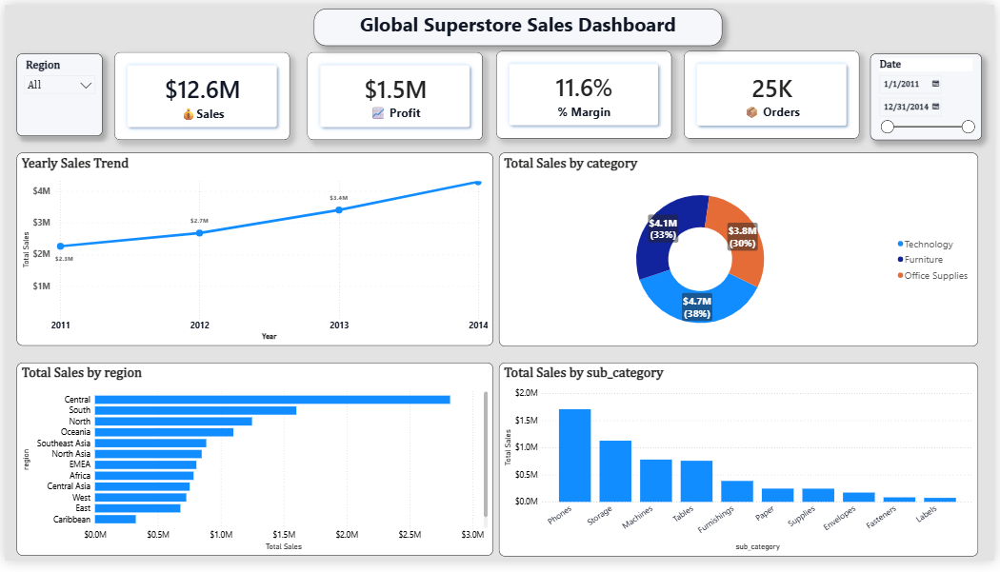

# 📊 Global Superstore Sales Dashboard

An interactive sales dashboard built with **Microsoft Power BI** using the Global Superstore dataset. This project focuses on transforming raw sales data into meaningful business insights through interactive reports and visualizations.

---

## 📷 Dashboard Preview



---

# 📖 About the Project

I built this dashboard to strengthen my Power BI and data visualization skills while working with a real-world retail dataset.

The dashboard enables users to explore sales performance, profitability, regional trends, and product performance through interactive charts, KPI cards, and slicers. It is designed to help users quickly identify patterns and answer common business questions.

---

# 🎯 Project Objectives

- Analyze overall sales and profit performance.
- Track sales trends over time.
- Compare sales across different regions.
- Identify the best-performing product categories and sub-categories.
- Build an interactive dashboard using Power BI best practices.
- Present business insights in a clear and user-friendly format.

---

# 📊 Dashboard Features

### KPI Cards
- Total Sales
- Total Profit
- Profit Margin
- Total Orders

### Visualizations
- 📈 Yearly Sales Trend
- 🍩 Sales by Category
- 📊 Sales by Region
- 📉 Sales by Sub-Category

### Interactive Filters
- Region
- Order Date

---

# 📈 Key Insights

- Sales showed steady growth throughout the analysis period.
- Technology generated the highest sales among all product categories.
- The Central region recorded the highest revenue.
- Phones were the top-selling sub-category.
- The dashboard highlights overall sales, profit, and profit margin at a glance.

---

# 🛠 Tools & Technologies

- Microsoft Power BI
- Power Query
- DAX (Data Analysis Expressions)
- Global Superstore Dataset (CSV)

---

# 📂 Repository Structure

```text
Global-Superstore-Sales-Dashboard/
│
├── Dashboard/
│   └── Global_Superstore_Sales_Dashboard.pbix
│
├── Datasets/
│   └── Sample-Superstore.csv
│
├── images/
│   ├── dashboard-overview.png
│   ├── kpi-cards.png
│   ├── yearly-sales-trend.png
│   ├── sales-by-category.png
│   ├── sales-by-region.png
│   ├── sales-by-subcategory.png
│   └── filters.png
│
├── README.md
├── LICENSE
└── .gitignore
```

---

# 🚀 Getting Started

1. Clone or download this repository.
2. Open `Dashboard/Global_Superstore_Sales_Dashboard.pbix` in **Microsoft Power BI Desktop**.
3. Explore the dashboard using the Region and Date slicers.

---

# 🔮 Future Improvements

- Customer sales analysis
- Sales forecasting
- Drill-through reports
- Mobile-optimized dashboard
- Row-Level Security (RLS)

---

# 👨‍💻 Author

**Your Name**

- GitHub: https://github.com/your-username
- LinkedIn: https://linkedin.com/in/your-linkedin

---

### ⭐ If you found this project helpful, consider giving it a star.
